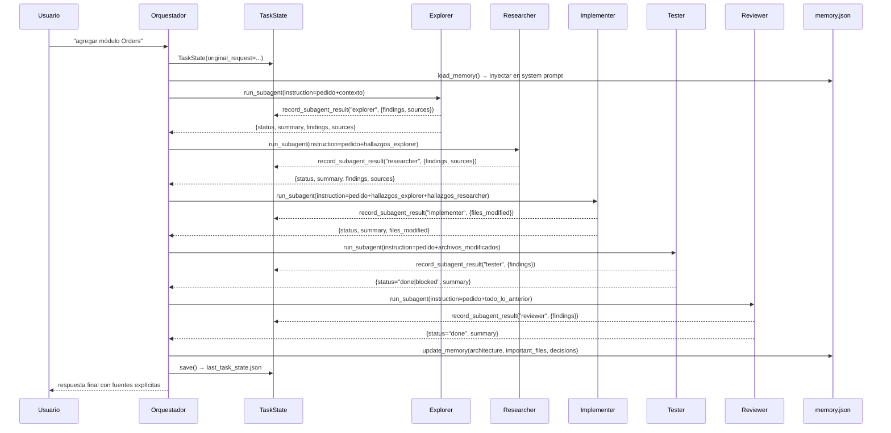
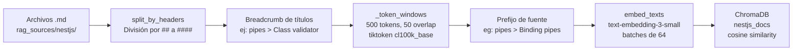

# Informe Técnico — TP Final: Coding Agent Avanzado (NestJS)

> **Materia**: Inteligencia Artificial  
> **Entrega**: Trabajo Práctico Final  
> **Descripción**: Sistema multi-agente de coding construido desde cero (sin frameworks de orquestación tipo LangChain/LangGraph/CrewAI), especializado en NestJS, con RAG sobre documentación oficial, memoria persistente por proyecto, subagentes especializados, políticas de seguridad configurables y observabilidad con Langfuse.

---

## Tabla de Contenidos

1. [README y Setup](#1-readme-y-setup)
2. [Caso de Uso](#2-caso-de-uso)
3. [Arquitectura del Sistema Multi-Agente](#3-arquitectura-del-sistema-multi-agente)
4. [Documentación del Sistema RAG](#4-documentación-del-sistema-rag)
5. [Evidencia de Ejecución](#5-evidencia-de-ejecución)
6. [Observabilidad](#6-observabilidad)
7. [Reflexión y Mejoras](#7-reflexión-y-mejoras)

---

## 1. README y Setup

### Requisitos del sistema

| Componente | Versión mínima |
|---|---|
| Python | 3.12 |
| Node.js | 20+ |
| npm | incluido con Node.js |

### Dependencias Python

Las dependencias se encuentran declaradas en `requirements.txt`:

```
openai>=1.50.0
langfuse>=2.53.0
chromadb>=0.5.5
tiktoken>=0.7.0
pyyaml>=6.0.1
requests>=2.32.0
python-dotenv>=1.0.1
```

### Instalación paso a paso

**1. Clonar el repositorio y crear el entorno virtual:**

```bash
git clone <url-del-repositorio>
cd tp-final-ia

python -m venv venv
```

**2. Activar el entorno virtual:**

```bash
# Windows
venv\Scripts\activate

# Linux / macOS
source venv/bin/activate
```

**3. Instalar dependencias Python:**

```bash
pip install -r requirements.txt
```

**4. Instalar dependencias del proyecto NestJS objetivo:**

```bash
cd workspace/ecommerce-api
npm install
cd ../..
```

### Configuración de variables de entorno

Copiar el archivo de ejemplo y completar los valores:

```bash
cp .env.example .env
```

Contenido del `.env` y descripción de cada variable:

```env
# Obligatorio: clave de la API de OpenAI para LLM y embeddings
OPENAI_API_KEY=sk-...

# Recomendado: clave de Tavily para búsqueda web (fallback del RAG)
TAVILY_API_KEY=tvly-...

# Opcional pero recomendado: observabilidad con Langfuse
# Crear cuenta gratuita en https://cloud.langfuse.com
LANGFUSE_PUBLIC_KEY=pk-lf-...
LANGFUSE_SECRET_KEY=sk-lf-...
LANGFUSE_HOST=https://cloud.langfuse.com

# Modelo de OpenAI a utilizar (por defecto: gpt-5-nano)
AGENT_MODEL=gpt-5-mini
```

> **Nota sobre el modelo**: Se recomienda `gpt-5-mini` en lugar de `gpt-5-nano`. Con `gpt-5-nano` el pipeline de 5 subagentes falla sistemáticamente: se agota el presupuesto de iteraciones antes de llamar a `submit_result`, y en sesiones multi-turno llega a alucinar campos no solicitados. `gpt-5-mini` cierra el pipeline completo de forma confiable.

### Configuración del workspace y políticas

El archivo `agent.config.yaml` define el proyecto objetivo y las políticas de seguridad:

```yaml
workspace: ./workspace/ecommerce-api

permissions:
  read:
    deny: [".env", ".env.*", "**/*.pem", "**/*.key", "secrets/**", "credentials.json"]
  write:
    deny: [".env", ".env.*", ".github/**", "package-lock.json", "**/*.lock"]

commands:
  deny: ["rm -rf", "rm -r /", "git push", "git push --force", "sudo", "chmod 777", "shutdown", "reboot"]
  require_approval: ["npm install", "npm uninstall", "npm ci", "git commit", "git add"]
```

### Indexar el sistema RAG (una sola vez)

Antes de la primera ejecución, es necesario procesar e indexar la documentación de NestJS en ChromaDB:

```bash
python -c "
from agent.llm import get_client
from agent.rag.ingest import ingest_directory
client = get_client()
total = ingest_directory(client)
print(f'Chunks indexados: {total}')
"
```

La salida esperada es `Chunks indexados: 118`.

### Ejecución del sistema

```bash
python main.py
```

El sistema abre un chat interactivo. Comandos disponibles en tiempo de ejecución:

| Comando | Descripción |
|---|---|
| `/plan on\|off` | Activa o desactiva el modo plan (genera un plan y pide aprobación antes de ejecutar) |
| `/supervision on\|off` | Activa o desactiva el modo supervisión (confirma herramientas destructivas) |
| `/status` | Muestra el estado actual de los modos y el contador de iteraciones |
| `/clear` | Limpia el historial de la sesión (conserva la memoria persistente del proyecto) |
| `/help` | Muestra la ayuda |
| `/exit` | Sale del sistema |

---

## 2. Caso de Uso

### Proyecto objetivo

El sistema opera sobre `workspace/ecommerce-api`, una API REST construida con NestJS que modela un sistema de e-commerce. Al momento de inicio del TP, el proyecto cuenta con un módulo `Products` completamente implementado, que sirve como convención de referencia:

- `src/products/products.controller.ts` — controlador REST con decoradores `@Get`, `@Post`, `@Patch`, `@Delete`, `@Param` con `ParseIntPipe`
- `src/products/products.service.ts` — servicio con storage in-memory, manejo de `NotFoundException`
- `src/products/dto/create-product.dto.ts` y `update-product.dto.ts` — DTOs validados con `class-validator` (`@IsString`, `@IsNumber`, `@IsOptional`)
- `src/products/entities/product.entity.ts` — entidad POJO
- `src/products/products.module.ts` — módulo NestJS

### Objetivo del sistema

El objetivo concreto del sistema multi-agente es **agregar el módulo `Orders`** completo (controller, service, DTOs, module, entity) relacionado con `Products` a través del campo `productId`, respetando exactamente las convenciones del módulo existente. El agente debe ser capaz, en sesiones posteriores, de iterar sobre ese módulo (agregar campos, nuevos endpoints, validaciones) reutilizando la memoria persistente del proyecto en vez de re-explorar el repositorio completo desde cero.

### Criterio de cumplimiento

Una tarea se considera exitosamente completada cuando:

1. **Build exitoso**: `npm run build` finaliza sin errores (TypeScript compila sin problemas)
2. **Tests pasantes**: `npm test` ejecuta la suite sin fallos
3. **Coherencia estilística**: el código generado sigue el patrón exacto del módulo `Products`: mismo estilo de DTOs con `class-validator`, mismo manejo de `NotFoundException` en el service, mismo uso de `ParseIntPipe` y `ParseEnumPipe` en el controller
4. **Trazabilidad de fuentes**: la respuesta final del agente lista explícitamente las fuentes consultadas por cada subagente (`repo`, `rag`, `web`, `memory` o `inference`)
5. **Revisión superada**: el subagente Reviewer valida el resultado contra el pedido original y devuelve `status=done`

---

## 3. Arquitectura del Sistema Multi-Agente

### Visión general


### 3.a Agente Principal — Orquestador (`agent/orchestrator.py`)

El Orquestador es el punto de entrada de toda interacción del usuario con el sistema. No es un agente especializado en código; su responsabilidad es **coordinar** el flujo de trabajo entre los subagentes, mantener el estado de la tarea y aplicar las políticas de guardrails.

#### Responsabilidades

- Mantiene el historial de conversación con el LLM (array de mensajes OpenAI)
- Construye el system prompt inicial, inyectando la memoria persistente del proyecto
- Ejecuta su propio loop de tool-calling (máximo `MAX_ORCHESTRATOR_ITERATIONS = 15` iteraciones por turno)
- Delega trabajo especializado a los subagentes mediante herramientas `delegate_to_<nombre>`
- Aplica guardrails a sus propias herramientas base antes de ejecutarlas
- Detecta loops con `LoopDetector` y frena el turno si superan `MAX_LOOP_WARNINGS = 2`
- Al finalizar cada turno: actualiza `memory.json` y serializa el `TaskState` a `last_task_state.json`

#### Herramientas base del Orquestador

| Herramienta | Descripción |
|---|---|
| `read_file` | Lectura de archivos del workspace (validada contra guardrails) |
| `run_command` | Ejecución de comandos shell (validada; destructivos requieren aprobación) |
| `list_files` | Listado de directorios dentro del workspace |
| `web_search` | Búsqueda web via Tavily (fallback de información) |

> **Restricción crítica**: El Orquestador **no posee `write_file`**. Ningún cambio de código puede ocurrir sin pasar por `delegate_to_implementer`. Esto convierte la delegación en una garantía estructural, no en una instrucción de prompt.

#### Herramientas de delegación

El Orquestador dispone de cinco herramientas de delegación, cada una con un único parámetro `instruction: string`:

```python
delegate_to_explorer(instruction: str)
delegate_to_researcher(instruction: str)
delegate_to_implementer(instruction: str)
delegate_to_tester(instruction: str)
delegate_to_reviewer(instruction: str)
```

El campo `instruction` debe incluir el pedido original completo del usuario (con nombres de campos, tipos y relaciones explícitos) más los hallazgos de subagentes anteriores. El system prompt del Orquestador prohíbe explícitamente resumir el pedido de forma que se pierdan detalles concretos.

#### Flujo forzado para tareas de código nuevo

El system prompt del Orquestador impone el siguiente orden de subagentes para cualquier tarea que implique escribir código:

```
Explorer → Researcher → Implementer → Tester → Reviewer
```

El sistema puede saltar Explorer si la memoria persistente ya contiene la información de arquitectura con suficiente detalle.

#### Manejo de `status=blocked`

Si un subagente devuelve `status=blocked`, el Orquestador **no reintenta automáticamente**. En cambio, extrae el campo `missing` del resultado y se lo comunica al usuario, solicitando información adicional o una decisión.

#### Compactación de historial

Cuando el historial supera `MAX_RAW_MESSAGES = 20` mensajes no-system, `compact_history()` llama al LLM para resumir los mensajes más antiguos y los reemplaza por un único mensaje de sistema, preservando los últimos `KEEP_RECENT_MESSAGES = 10` mensajes en crudo. El corte siempre se alinea al límite de un mensaje `user` para no separar un par tool_call/response.

---

### 3.b Subagentes (`agent/subagents/`)

Cada subagente es ejecutado por la función `run_subagent()` en `agent/subagents/base.py`, que corre un loop de tool-calling **completamente independiente** del Orquestador (historial propio, presupuesto de iteraciones propio). Al terminar, devuelve un resultado estructurado que se almacena en el `TaskState` compartido.

#### Runner genérico (`run_subagent`)

```python
MAX_SUBAGENT_ITERATIONS = 25
```

A las 5 iteraciones restantes del presupuesto, el runner inyecta un mensaje de sistema que fuerza al subagente a llamar `submit_result` de inmediato con lo que tenga hasta ese momento. Si el presupuesto se agota sin que el subagente llame a `submit_result`, el runner devuelve automáticamente `status=blocked`.

#### Herramienta universal `submit_result`

Todos los subagentes disponen de esta herramienta especial para reportar su resultado final:

```json
{
  "status": "done" | "blocked",
  "summary": "Resumen de lo realizado",
  "findings": ["hallazgo 1", "hallazgo 2", "..."],
  "sources": [
    {"kind": "repo|memory|rag|web|inference", "ref": "ruta o URL"}
  ],
  "missing": "Qué falta si status=blocked"
}
```

#### Detalle de cada subagente

**Explorer** (`agent/subagents/explorer.py`)

- **Rol**: Reconocimiento del repositorio. Mapea estructura de carpetas, módulos NestJS existentes, convenciones de nombres (controller/service/DTO/module), dependencias en `package.json` y comandos de build/test/lint.
- **Herramientas**: `read_file`, `list_files`, `run_command`, `rag_search`
- **Restricción clave**: Estrictamente de solo lectura. El system prompt prohíbe explícitamente comandos que modifiquen el proyecto. Distingue entre convenciones propias del repo y estándares de NestJS consultando `rag_search`. Devuelve `status=blocked` antes de adivinar.
- **Fuentes citadas**: `kind=repo` para lo leído del código, `kind=rag` si usó el índice vectorial.

**Researcher** (`agent/subagents/researcher.py`)

- **Rol**: Investigar cómo implementar patrones, decoradores y APIs de NestJS, proveyendo al Implementer de evidencia respaldada por fuentes antes de escribir código.
- **Herramientas**: `rag_search`, `web_search`, `read_file`
- **Prioridad de fuentes** (obligatoria):
  1. `rag_search` — documentación oficial de NestJS indexada
  2. `web_search` — fallback si el RAG tiene baja relevancia (score < 0.25)
  3. `read_file` — para contexto del código actual del proyecto
  4. **Nunca** inventa una API sin respaldo de fuente
- **Restricción clave**: Si no encuentra evidencia suficiente, devuelve `status=blocked` con el campo `missing` explicando qué falta.

**Implementer** (`agent/subagents/implementer.py`)

- **Rol**: El único subagente con permiso de escritura. Produce o modifica archivos `.ts` basándose en los hallazgos del Explorer y el Researcher.
- **Herramientas**: `read_file`, `write_file`, `list_files`, `rag_search`
- **Restricción clave**: Debe adherirse a las convenciones detectadas por Explorer. Bloquea ante pedidos ambiguos o destructivos en vez de asumir. Termina con `submit_result` listando todos los archivos escritos.

**Tester** (`agent/subagents/tester.py`)

- **Rol**: Validar la implementación ejecutando build, tests y lint. Solo reporta resultados, no corrige código.
- **Herramientas**: `run_command`, `read_file`
- **Restricción clave**: Pura ejecución y observación. El system prompt prohíbe repetir el mismo comando dos veces y prohíbe modificar código. Devuelve `status=done` si todo pasa, `status=blocked` con el error detallado si algo falla.

**Reviewer** (`agent/subagents/reviewer.py`)

- **Rol**: Puerta de validación final. Lee los archivos modificados (o corre `git diff`) y verifica que los cambios satisfagan el pedido original del usuario, sigan las convenciones del proyecto y no dejen código roto o incompleto.
- **Herramientas**: `read_file`, `run_command`
- **Restricción clave**: Sin acceso de escritura. El system prompt exige juicio crítico explícito, prohibiendo el rubber-stamping. Si detecta problemas, los reporta para una iteración adicional del Implementer.

---

### 3.c Estado compartido (`agent/state.py`)

El `TaskState` es el objeto de datos que fluye entre el Orquestador y todos los subagentes durante la ejecución de un único turno. No es compartido por referencia directa a los subagentes (que operan de forma independiente), sino que el Orquestador lo actualiza después de recibir cada resultado de `run_subagent()`.

#### Estructura del `TaskState`

```python
@dataclass
class TaskState:
    original_request: str           # Pedido original del usuario, sin modificar
    plan: Optional[str]             # Plan generado en plan mode (si está activo)
    progress: list[str]             # Log cronológico de pasos completados
    subagent_results: dict          # {nombre_subagente: resultado_completo}
    sources_consulted: list[dict]   # [{subagent, kind, ref}, ...]
    files_modified: list[str]       # Archivos escritos por el Implementer
    observations: list[str]         # Notas del sistema (ej. loops detectados)
    iteration_count: int            # Total de tool calls ejecutadas
    loop_warnings: int              # Cantidad de loops detectados en este turno
    created_at: str                 # Timestamp ISO 8601 UTC
```

#### Flujo de información entre agentes



#### Trazabilidad de fuentes

El campo `sources_consulted` del `TaskState` agrega automáticamente las fuentes reportadas por cada subagente en su `submit_result`. Cada entrada tiene la forma:

```json
{
  "subagent": "researcher",
  "kind": "rag",
  "ref": "pipes > Binding pipes"
}
```

Los valores posibles de `kind` son: `repo`, `memory`, `rag`, `web`, `inference`. Esta información se expone explícitamente en la respuesta final del Orquestador, cumpliendo el criterio de trazabilidad de fuentes de la consigna.

---

### 3.d Detección de loops (`agent/context.py`)

```python
LOOP_REPEAT_THRESHOLD = 3   # repeticiones para disparar la advertencia
MAX_LOOP_WARNINGS = 2       # advertencias antes de frenar el turno
```

`LoopDetector` mantiene una ventana deslizante de las últimas 6 tool calls como tuplas `(tool_name, sha256(args)[:16], sha256(result)[:16])`. Si el mismo triplete aparece ≥3 veces, inyecta `LOOP_WARNING_MESSAGE` al final del resultado de la tool, forzando al LLM a cambiar de estrategia. Si se superan 2 advertencias en un mismo turno, el Orquestador frena la ejecución y comunica el bloqueo al usuario.

---

### 3.e Memoria persistente (`agent/memory.py`)

```
memory_store/<slug-del-workspace>/memory.json
```

El slug es el path del workspace sanitizado (caracteres no alfanuméricos reemplazados por guiones). Todos los paths de la memoria están anclados a la raíz del repo del agente via `agent/paths.py` para evitar que el `os.chdir()` de `main.py` los resuelva dentro del proyecto NestJS del usuario.

**Campos de la memoria:**

| Campo | Tipo | Descripción |
|---|---|---|
| `architecture` | `string` | Descripción de la arquitectura detectada por Explorer (reemplazada en cada actualización) |
| `important_files` | `list[str]` | Archivos clave del proyecto (merge sin duplicados) |
| `dependencies` | `list[str]` | Dependencias npm relevantes |
| `useful_commands` | `list[str]` | Comandos de build/test/lint |
| `conventions` | `list[str]` | Convenciones de código detectadas |
| `decisions` | `list[str]` | Decisiones de diseño tomadas en sesiones anteriores |
| `investigated_bugs` | `list[str]` | Bugs investigados |
| `session_summaries` | `list[{date, summary}]` | Resumen de cada sesión (append-only) |

`format_memory_for_prompt()` compacta la memoria a máximo 10 ítems por lista y las últimas 3 sesiones, para inyectarla en el system prompt sin saturar el contexto del LLM.

---

### 3.f Políticas de seguridad (`agent/config.py`)

`validate_tool_call()` es llamada **antes de ejecutar cualquier tool**, tanto en el Orquestador como en cada subagente. Implementa tres tipos de validación:

1. **Sandbox**: resuelve el path absoluto y lo rechaza si cae fuera de `cfg.workspace`
2. **Deny lists**: matching con `fnmatch` contra patrones de la configuración. También evalúa el destino de redirecciones shell (`> archivo`) en comandos
3. **Require approval**: comandos en la lista marcados con `requires_approval=True`; siempre piden confirmación por consola, independientemente del modo supervisión

---

## 4. Documentación del Sistema RAG

### Fuentes de datos

El corpus RAG consiste en **9 páginas de la documentación oficial de NestJS**, obtenidas del repositorio de fuentes markdown `nestjs/docs.nestjs.com` (no HTML scrapeado, dado que el sitio es una SPA cuyo HTML crudo carece de contenido indexable). Los archivos se encuentran en `rag_sources/nestjs/`:

| Archivo | Contenido |
|---|---|
| `first-steps.md` | Introducción y estructura de un proyecto NestJS |
| `controllers.md` | Decoradores de controladores, rutas, parámetros, códigos HTTP |
| `providers.md` | Inyección de dependencias, servicios, scopes |
| `modules.md` | Módulos, imports, exports, módulos globales |
| `pipes.md` | Pipes de transformación y validación, `ParseIntPipe`, `ParseEnumPipe` |
| `validation.md` | `ValidationPipe`, `class-validator`, `class-transformer` |
| `exception-filters.md` | Filtros de excepción, `HttpException`, `NotFoundException` |
| `guards.md` | Guards de autenticación y autorización |
| `unit-testing.md` | Testing con Jest, `Test.createTestingModule` |

### Pipeline de ingesta (`agent/rag/ingest.py`)



#### Estrategia de chunking

El chunking es bifásico, diseñado para preservar contexto semántico sin generar vectores de secciones enteras:

**Fase 1 — División por headers markdown**

La función `split_by_headers()` utiliza la expresión regular `^(#{2,4})\s+(.*)$` para identificar headers de nivel `##` a `####`. Cada sección se almacena junto con su **breadcrumb de títulos** (path jerárquico de headings), por ejemplo:

```
pipes > Binding pipes > Class validator
```

Este breadcrumb se antepone al texto de cada chunk como prefijo, proveyendo contexto al momento del embedding y de la recuperación.

**Fase 2 — Ventana deslizante de tokens**

```python
CHUNK_TOKENS = 500    # tamaño de la ventana en tokens
CHUNK_OVERLAP = 50    # solapamiento entre ventanas consecutivas
```

La función `_token_windows()` tokeniza cada sección con `tiktoken` (encoding `cl100k_base`, el mismo usado por los modelos de OpenAI) y produce ventanas deslizantes. El solapamiento de 50 tokens garantiza que ideas que atraviesan el límite de una ventana queden representadas en al menos uno de los dos chunks adyacentes.

Resultado total: **118 chunks** sobre las 9 fuentes.

### Modelo de embeddings

```
Proveedor: OpenAI
Modelo: text-embedding-3-small
Dimensión de vector: 1536
```

Los embeddings se generan en batches de 64 chunks por llamada a la API para evitar rate limiting. En el proceso de ingesta, el corpus completo es reindexado desde cero (los IDs existentes se eliminan antes de reinsertar), lo que garantiza consistencia pero implica que no hay actualización incremental.

### Motor de almacenamiento vectorial

```
Motor: ChromaDB
Tipo: PersistentClient (local, en disco)
Directorio: rag_sources/chroma_db/
Colección: nestjs_docs
Métrica de similaridad: coseno (hnsw:space: cosine)
```

#### Pipeline de recuperación (`agent/rag/store.py`)

```python
score = 1 - distance   # conversión de distancia coseno a similaridad
```

ChromaDB devuelve distancias coseno (donde 0 = idéntico, 2 = opuesto). La función `query()` convierte este valor en un score de similaridad en `[0, 1]` donde 1 significa máxima similitud.

#### Umbral de relevancia y fallback

```python
MIN_RELEVANCE_SCORE = 0.25   # definido en agent/tools/rag_tools.py
```

Si el mejor score entre los `k=4` chunks recuperados es inferior a 0.25, la tool `rag_search` antepone una advertencia explícita al resultado, sugiriendo usar `web_search` como alternativa. El Researcher tiene instruido en su system prompt seguir esta jerarquía: RAG → web → inferencia propia.

#### Trazabilidad de recuperaciones

Cada llamada a `rag_search` es registrada en Langfuse como un evento `rag:retrieval` por `observability.log_retrieval()`, incluyendo la query, la fuente (`source`), el heading (`heading`) y el score del mejor resultado.

---

## 5. Evidencia de Ejecución

> [!NOTE]
> **COMPLETAR MANUALMENTE**
>
> Documentar al menos dos tareas ejecutadas con el sistema. Para cada tarea, incluir:
> - El prompt exacto enviado al agente
> - La secuencia de subagentes invocados (Explorer → Researcher → Implementer → Tester → Reviewer)
> - El output completo del CLI (o un extracto representativo)
> - Las fuentes recuperadas por el RAG (`kind=rag`) y las fuentes del repo (`kind=repo`)
> - El veredicto del Reviewer (`status=done` o `status=blocked` con `missing`)
> - Si la tarea falló o fue bloqueada, explicar el motivo

### Tarea 1 — [Descripción breve]

**Prompt enviado:**
```
[INSERTAR PROMPT AQUÍ]
```

**Secuencia de subagentes:**

```
[INSERTAR: ej. Explorer (8 iter.) → Researcher (6 iter.) → Implementer (12 iter.) → Tester (3 iter.) → Reviewer (4 iter.)]
```

**Output del CLI:**

```
[PEGAR OUTPUT DEL TERMINAL AQUÍ]
```

**Fuentes consultadas:**

| Subagente | Kind | Referencia |
|---|---|---|
| Explorer | `repo` | [INSERTAR] |
| Researcher | `rag` | [INSERTAR, ej: pipes > Binding pipes] |
| Implementer | `repo` | [INSERTAR] |

**Veredicto del Reviewer:** `[done / blocked]`

**Archivos modificados:**
- [INSERTAR lista de archivos .ts creados o modificados]

---

### Tarea 2 — [Descripción breve]

**Prompt enviado:**
```
[INSERTAR PROMPT AQUÍ]
```

**Secuencia de subagentes:**

```
[INSERTAR]
```

**Output del CLI:**

```
[PEGAR OUTPUT DEL TERMINAL AQUÍ]
```

**Fuentes consultadas:**

| Subagente | Kind | Referencia |
|---|---|---|
| [INSERTAR] | [INSERTAR] | [INSERTAR] |

**Veredicto del Reviewer:** `[done / blocked]`

**¿Se reutilizó la memoria persistente de sesiones anteriores?**

> [DESCRIBIR qué campos de memory.json ya estaban poblados y cómo el Orquestador los aprovechó para no re-explorar el repo desde cero]

---

## 6. Observabilidad

El sistema utiliza **Langfuse** para trazabilidad completa de todas las llamadas al LLM, ejecuciones de subagentes y operaciones de RAG.

### Implementación técnica (`agent/observability.py`)

- `langfuse.openai.OpenAI` reemplaza al cliente de OpenAI como wrapper transparente (drop-in replacement). Esto permite trazar automáticamente cada llamada al LLM con: modelo, tokens de input/output, latencia y costo estimado, sin cambios en el código de llamada.
- `@observe_agent(name, as_type)` decora el método `run_turn` del Orquestador y la función `_run_subagent_impl` de cada subagente, generando spans anidados en el árbol de trazas.
- `log_tool_call(subagent, tool_name, args, result)` registra cada ejecución de herramienta como evento hijo del span del subagente correspondiente.
- `log_retrieval(query, results)` registra cada recuperación RAG como evento `rag:retrieval` con la query, la fuente, el heading y el score del mejor resultado.
- `log_error(context, error)` registra excepciones como eventos de nivel ERROR.
- El sistema degrada graciosamente si las credenciales de Langfuse no están configuradas (no lanza excepciones).

### Árbol de spans esperado por turno

```
orchestrator:turn  [span]
├── subagent:explorer  [span]
│   ├── tool:list_files  [evento]
│   ├── tool:read_file   [evento]
│   └── rag:retrieval    [evento, score + fuente]
├── subagent:researcher  [span]
│   ├── rag:retrieval    [evento]
│   └── tool:web_search  [evento, si RAG < 0.25]
├── subagent:implementer  [span]
│   ├── tool:read_file   [evento]
│   └── tool:write_file  [evento]
├── subagent:tester  [span]
│   └── tool:run_command  [evento, npm run build + npm test]
└── subagent:reviewer  [span]
    └── tool:read_file   [evento]
```

### Capturas de pantalla del dashboard de Langfuse

> [!NOTE]
> **COMPLETAR MANUALMENTE**
>
> Insertar las capturas de pantalla del dashboard de Langfuse correspondientes a una corrida completa. Se sugiere incluir las siguientes vistas:
>
> **(a) Árbol de spans completo**
> Mostrar la jerarquía completa de spans de un turno: `orchestrator:turn` → `subagent:*` con sus eventos hijo.
>
> **(b) GENERATION expandida**
> Expandir una llamada al LLM individual mostrando: prompt completo, modelo (`gpt-5-mini`), tokens de input, tokens de output y latencia.
>
> **(c) Evento `rag:retrieval` expandido**
> Mostrar un evento de recuperación RAG con la query, la fuente recuperada (ej. `pipes > Binding pipes`), el heading y el score de similaridad.
>
> **(d) Vista de métricas agregadas** *(opcional)*
> Panel de costos y tokens totales por sesión o por subagente.

<!-- INSERTAR CAPTURAS DE PANTALLA AQUÍ -->

---

## 7. Reflexión y Mejoras

> [!NOTE]
> **COMPLETAR MANUALMENTE**
>
> Desarrollar cada punto con ejemplos concretos de las corridas realizadas. Evitar respuestas genéricas: referenciar iteraciones específicas, outputs del CLI, o comportamientos observados durante las pruebas.

### ¿Qué funcionó bien?

- **[COMPLETAR]** La separación de herramientas por subagente (solo el Implementer escribe) forzó estructuralmente el uso de la arquitectura multi-agente. Desarrollar con un ejemplo concreto de una corrida donde esto fue determinante.
- **[COMPLETAR]** El mecanismo de `status=blocked` generó casos reales (no forzados) en que el agente pidió ayuda al usuario en lugar de asumir. Describir al menos un caso específico.
- **[COMPLETAR]** La memoria persistente permitió que sesiones posteriores no re-exploraran el repo desde cero. Detallar qué campos ya estaban poblados y cuántas iteraciones se ahorraron.
- **[COMPLETAR]** El RAG recuperó chunks relevantes con la jerarquía de fuentes correcta (RAG → web → inferencia). Citar un ejemplo con el score obtenido.

### ¿Qué falló o presentó limitaciones?

- **Degradación con `gpt-5-nano`**: Con el modelo más liviano, el pipeline de 5 subagentes fallaba sistemáticamente por agotamiento de iteraciones antes de llamar a `submit_result`. En corridas multi-turno se observó alucinación de campos no solicitados. La solución fue migrar a `gpt-5-mini`.
- **Bug `os.chdir()` y paths relativos**: El `chdir()` al workspace NestJS en `main.py` hacía que `memory_store/` y `rag_sources/chroma_db/` se escribieran dentro del repo del usuario. Corregido anclando los paths a la raíz del agente via `agent/paths.py`.
- **Bug `TypeError` por argumentos alucinados**: Un tool call con un parámetro inexistente generado por el modelo tiraba el proceso completo. Corregido con `try/except TypeError` en cada ejecución de tool.
- **Límite del `LoopDetector` con timestamps en outputs**: Comandos como `npm run <script-inexistente>` incluyen un timestamp en la ruta del log de error, por lo que "el mismo fallo" no siempre produce el mismo string. El detector no dispara en estos casos. Verificado con comandos de output 100% determinístico.
- **Redundancia de lecturas entre subagentes**: Los subagentes son stateless entre sí; cada uno re-lee archivos que ya leyó un subagente anterior, generando gasto de iteraciones. Mejora pendiente: pasar un resumen estructurado de hallazgos previos.
- **[COMPLETAR]** Agregar cualquier otro fallo o comportamiento inesperado observado durante las pruebas propias.

### ¿Se detectaron loops? ¿Cómo respondió el sistema?

- **[COMPLETAR]** Describir al menos una situación donde el `LoopDetector` disparó. Incluir: qué tool se repitió, cuántas veces, qué mensaje inyectó el sistema y cómo respondió el LLM ante la advertencia (cambió de estrategia, escaló al usuario, etc.).
- El sistema está diseñado para detectar la repetición del triplete `(tool_name, sha256(args), sha256(result))` ≥3 veces en una ventana de 6 llamadas. Tras 2 advertencias, frena el turno y comunica el bloqueo al usuario.

### Propuestas de mejora

- **Hallazgos estructurados entre subagentes**: En lugar de pasar los hallazgos del Explorer como texto libre en el campo `instruction`, pasar un objeto estructurado (archivos importantes, convenciones detectadas, comandos) que el Implementer y el Researcher puedan consumir directamente sin re-leer el repo.
- **`LoopDetector` tolerante a timestamps**: Normalizar o limpiar el output de la tool (eliminar timestamps, rutas absolutas, contadores) antes de hashear para el detector de loops, o comparar únicamente `tool_name` + código de retorno del proceso.
- **Generación automática de tests**: El Reviewer actualmente detecta que faltan tests para el código nuevo, pero ningún subagente los agrega automáticamente. Una mejora sería darle al Implementer o al Tester la capacidad de generar tests unitarios para los archivos que crea.
- **Costo estimado por subagente**: Langfuse no calcula el costo para `gpt-5-mini` con la tabla de precios del SDK actual. Configurarlo manualmente en el dashboard para tener visibilidad de costos por subagente y por sesión.
- **Plugin system para tools**: Las tools están registradas de forma estática en `agent/tools/registry.py`. Un sistema de plugins permitiría agregar herramientas nuevas (ej. integración con GitHub, Jira, o bases de datos) sin modificar el código core.
- **[COMPLETAR]** Agregar propuestas adicionales surgidas de las pruebas propias.
