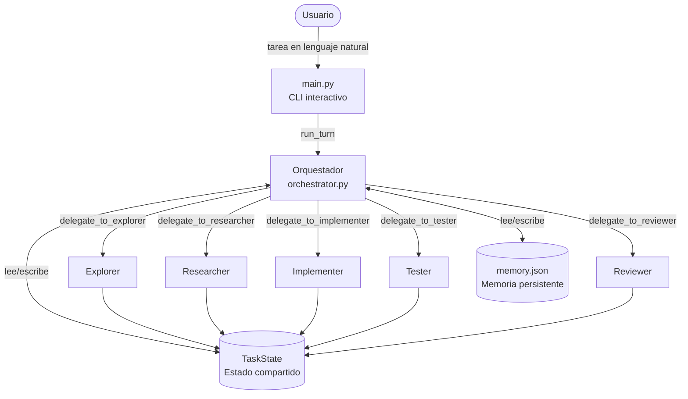
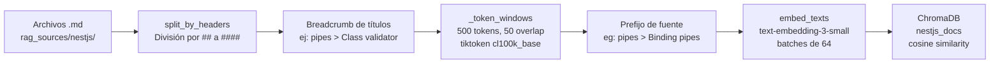

# Informe Técnico — TP Final: Coding Agent Avanzado (NestJS)

> **Materia**: Inteligencia Artificial  
> **Entrega**: Trabajo Práctico Final  
> **Descripción**: Sistema multi-agente de coding construido desde cero (sin frameworks de orquestación tipo LangChain/LangGraph/CrewAI), especializado en NestJS, con RAG sobre documentación oficial, memoria persistente por proyecto, subagentes especializados, políticas de seguridad configurables y observabilidad con Langfuse.

---

## Tabla de Contenidos

1. [README y Setup](#1-readme-y-setup)
2. [Caso de Uso](#2-caso-de-uso)
3. [Arquitectura del Sistema Multi-Agente](#3-arquitectura-del-sistema-multi-agente)
4. [Documentación del Sistema RAG](#4-documentación-del-sistema-rag)
5. [Evidencia de Ejecución](#5-evidencia-de-ejecución)
6. [Observabilidad](#6-observabilidad)
7. [Reflexión y Mejoras](#7-reflexión-y-mejoras)

---

## 1. README y Setup

### Requisitos del sistema

| Componente | Versión mínima |
|---|---|
| Python | 3.12 |
| Node.js | 20+ |
| npm | incluido con Node.js |

### Dependencias Python

Las dependencias se encuentran declaradas en `requirements.txt`:

```
openai>=1.50.0
langfuse>=2.53.0
chromadb>=0.5.5
tiktoken>=0.7.0
pyyaml>=6.0.1
requests>=2.32.0
python-dotenv>=1.0.1
```

### Instalación paso a paso

**1. Clonar el repositorio y crear el entorno virtual:**

```bash
git clone <url-del-repositorio>
cd tp-final-ia

python -m venv venv
```

**2. Activar el entorno virtual:**

```bash
# Windows
venv\Scripts\activate

# Linux / macOS
source venv/bin/activate
```

**3. Instalar dependencias Python:**

```bash
pip install -r requirements.txt
```

**4. Instalar dependencias del proyecto NestJS objetivo:**

```bash
cd workspace/ecommerce-api
npm install
cd ../..
```

### Configuración de variables de entorno

Copiar el archivo de ejemplo y completar los valores:

```bash
cp .env.example .env
```

Contenido del `.env` y descripción de cada variable:

```env
# Obligatorio: clave de la API de OpenAI para LLM y embeddings
OPENAI_API_KEY=sk-...

# Recomendado: clave de Tavily para búsqueda web (fallback del RAG)
TAVILY_API_KEY=tvly-...

# Opcional pero recomendado: observabilidad con Langfuse
# Crear cuenta gratuita en https://cloud.langfuse.com
LANGFUSE_PUBLIC_KEY=pk-lf-...
LANGFUSE_SECRET_KEY=sk-lf-...
LANGFUSE_HOST=https://cloud.langfuse.com

# Modelo de OpenAI a utilizar (por defecto: gpt-5-nano)
AGENT_MODEL=gpt-5-mini
```

> **Nota sobre el modelo**: Se recomienda `gpt-5-mini` en lugar de `gpt-5-nano`. Con `gpt-5-nano` el pipeline de 5 subagentes falla sistemáticamente: se agota el presupuesto de iteraciones antes de llamar a `submit_result`, y en sesiones multi-turno llega a alucinar campos no solicitados. `gpt-5-mini` cierra el pipeline completo de forma confiable.

### Configuración del workspace y políticas

El archivo `agent.config.yaml` define el proyecto objetivo y las políticas de seguridad:

```yaml
workspace: ./workspace/ecommerce-api

permissions:
  read:
    deny: [".env", ".env.*", "**/*.pem", "**/*.key", "secrets/**", "credentials.json"]
  write:
    deny: [".env", ".env.*", ".github/**", "package-lock.json", "**/*.lock"]

commands:
  deny: ["rm -rf", "rm -r /", "git push", "git push --force", "sudo", "chmod 777", "shutdown", "reboot"]
  require_approval: ["npm install", "npm uninstall", "npm ci", "git commit", "git add"]
```

### Indexar el sistema RAG (una sola vez)

Antes de la primera ejecución, es necesario procesar e indexar la documentación de NestJS en ChromaDB:

```bash
python -c "
from agent.llm import get_client
from agent.rag.ingest import ingest_directory
client = get_client()
total = ingest_directory(client)
print(f'Chunks indexados: {total}')
"
```

La salida esperada es `Chunks indexados: 118`.

### Ejecución del sistema

```bash
python main.py
```

El sistema abre un chat interactivo. Comandos disponibles en tiempo de ejecución:

| Comando | Descripción |
|---|---|
| `/plan on\|off` | Activa o desactiva el modo plan (genera un plan y pide aprobación antes de ejecutar) |
| `/supervision on\|off` | Activa o desactiva el modo supervisión (confirma herramientas destructivas) |
| `/status` | Muestra el estado actual de los modos y el contador de iteraciones |
| `/clear` | Limpia el historial de la sesión (conserva la memoria persistente del proyecto) |
| `/help` | Muestra la ayuda |
| `/exit` | Sale del sistema |

---

## 2. Caso de Uso

### Proyecto objetivo

El sistema opera sobre `workspace/ecommerce-api`, una API REST construida con NestJS que modela un sistema de e-commerce. Al momento de este caso de uso, el proyecto ya cuenta con dos módulos completos que sirven como convención de referencia:

- **`Products`** (`src/products/`): `products.controller.ts` con decoradores `@Get`/`@Post`/`@Patch`/`@Delete` y `ParseIntPipe`; `products.service.ts` con storage in-memory y manejo de `NotFoundException`; DTOs validados con `class-validator` (`@IsString`, `@IsNumber`, `@IsOptional`); entidad POJO.
- **`Orders`** (`src/orders/`): relacionado con `Products` a través de `productId`, con transición de estado (`PENDING` → `SHIPPED`) manejada en el service, siguiendo el mismo estilo de DTOs, excepciones y pipes que `Products`.

### Objetivo del sistema

El objetivo concreto del sistema multi-agente es **agregar autenticación mediante un `ApiKeyGuard`** de NestJS que proteja los endpoints de escritura (`POST`, `PATCH`, `DELETE`) de `ProductsController` y `OrdersController`, dejando los `GET` públicos. El guard debe:

- Implementar el patrón oficial de NestJS (`CanActivate`, `ExecutionContext`), no una versión inventada.
- Validar el header `x-api-key` contra `process.env.API_KEY` (con un valor de prueba por default).
- Responder `401 Unauthorized` con un mensaje claro cuando el header falta o no coincide.

Se eligió esta tarea sobre una feature nueva (en vez de, por ejemplo, extender un DTO existente) porque el patrón de Guards de NestJS no es algo que un LLM pueda resolver de memoria con confianza — obliga al subagente Researcher a apoyarse en el RAG en vez de improvisar la API, y permite demostrar en una sola tarea los tres comportamientos que pide la consigna: uso de RAG con fuentes trazadas, reuso de memoria persistente entre sesiones, y el agente deteniéndose a pedir una decisión (o señalando un problema) en vez de asumir.

### Criterio de cumplimiento

Una tarea se considera exitosamente completada cuando:

1. **Build exitoso**: `npm run build` finaliza sin errores (TypeScript compila sin problemas).
2. **Tests pasantes**: `npm test` (unitarios) y `npm run test:e2e` (end-to-end) ejecutan sin fallos.
3. **Coherencia estilística**: el guard está tipado (sin `any`, usando `Request` de `express`) y aplicado de forma consistente con `@UseGuards(ApiKeyGuard)` en ambos controllers, siguiendo el patrón `CanActivate`/`ExecutionContext` documentado en la fuente RAG (`rag_sources/nestjs/guards.md`).
4. **Trazabilidad de fuentes**: la respuesta final del agente lista explícitamente las fuentes consultadas por cada subagente (`repo`, `rag`, `web`, `memory` o `inference`).
5. **Revisión superada**: el subagente Reviewer valida el resultado contra el pedido original y devuelve `status=done`.

La evidencia de que estos cinco criterios se cumplieron está en la sección 5, incluyendo verificación independiente (`build`/`test`/`lint`/`test:e2e` corridos fuera del agente, no solo lo que el agente reportó).

---

## 3. Arquitectura del Sistema Multi-Agente

### Visión general



### 3.a Agente Principal — Orquestador (`agent/orchestrator.py`)

El Orquestador es el punto de entrada de toda interacción del usuario con el sistema. No es un agente especializado en código; su responsabilidad es **coordinar** el flujo de trabajo entre los subagentes, mantener el estado de la tarea y aplicar las políticas de guardrails.

#### Responsabilidades

- Mantiene el historial de conversación con el LLM (array de mensajes OpenAI)
- Construye el system prompt inicial, inyectando la memoria persistente del proyecto
- Ejecuta su propio loop de tool-calling (máximo `MAX_ORCHESTRATOR_ITERATIONS = 15` iteraciones por turno)
- Delega trabajo especializado a los subagentes mediante herramientas `delegate_to_<nombre>`
- Aplica guardrails a sus propias herramientas base antes de ejecutarlas
- Detecta loops con `LoopDetector` y frena el turno si superan `MAX_LOOP_WARNINGS = 2`
- Al finalizar cada turno: actualiza `memory.json` y serializa el `TaskState` a `last_task_state.json`

#### Herramientas base del Orquestador

| Herramienta | Descripción |
|---|---|
| `read_file` | Lectura de archivos del workspace (validada contra guardrails) |
| `run_command` | Ejecución de comandos shell (validada; destructivos requieren aprobación) |
| `list_files` | Listado de directorios dentro del workspace |
| `web_search` | Búsqueda web via Tavily (fallback de información) |

> **Restricción crítica**: El Orquestador **no posee `write_file`**. Ningún cambio de código puede ocurrir sin pasar por `delegate_to_implementer`. Esto convierte la delegación en una garantía estructural, no en una instrucción de prompt.

#### Herramientas de delegación

El Orquestador dispone de cinco herramientas de delegación, cada una con un único parámetro `instruction: string`:

```python
delegate_to_explorer(instruction: str)
delegate_to_researcher(instruction: str)
delegate_to_implementer(instruction: str)
delegate_to_tester(instruction: str)
delegate_to_reviewer(instruction: str)
```

El campo `instruction` debe incluir el pedido original completo del usuario (con nombres de campos, tipos y relaciones explícitos) más los hallazgos de subagentes anteriores. El system prompt del Orquestador prohíbe explícitamente resumir el pedido de forma que se pierdan detalles concretos.

#### Flujo forzado para tareas de código nuevo

El system prompt del Orquestador impone el siguiente orden de subagentes para cualquier tarea que implique escribir código:

```
Explorer → Researcher → Implementer → Tester → Reviewer
```

El sistema puede saltar Explorer si la memoria persistente ya contiene la información de arquitectura con suficiente detalle.

#### Manejo de `status=blocked`

Si un subagente devuelve `status=blocked`, el Orquestador **no reintenta automáticamente**. En cambio, extrae el campo `missing` del resultado y se lo comunica al usuario, solicitando información adicional o una decisión.

#### Compactación de historial

Cuando el historial supera `MAX_RAW_MESSAGES = 20` mensajes no-system, `compact_history()` llama al LLM para resumir los mensajes más antiguos y los reemplaza por un único mensaje de sistema, preservando los últimos `KEEP_RECENT_MESSAGES = 10` mensajes en crudo. El corte siempre se alinea al límite de un mensaje `user` para no separar un par tool_call/response.

---

### 3.b Subagentes (`agent/subagents/`)

Cada subagente es ejecutado por la función `run_subagent()` en `agent/subagents/base.py`, que corre un loop de tool-calling **completamente independiente** del Orquestador (historial propio, presupuesto de iteraciones propio). Al terminar, devuelve un resultado estructurado que se almacena en el `TaskState` compartido.

#### Runner genérico (`run_subagent`)

```python
MAX_SUBAGENT_ITERATIONS = 25
```

A las 5 iteraciones restantes del presupuesto, el runner inyecta un mensaje de sistema que fuerza al subagente a llamar `submit_result` de inmediato con lo que tenga hasta ese momento. Si el presupuesto se agota sin que el subagente llame a `submit_result`, el runner devuelve automáticamente `status=blocked`.

#### Herramienta universal `submit_result`

Todos los subagentes disponen de esta herramienta especial para reportar su resultado final:

```json
{
  "status": "done" | "blocked",
  "summary": "Resumen de lo realizado",
  "findings": ["hallazgo 1", "hallazgo 2", "..."],
  "sources": [
    {"kind": "repo|memory|rag|web|inference", "ref": "ruta o URL"}
  ],
  "missing": "Qué falta si status=blocked"
}
```

#### Detalle de cada subagente

**Explorer** (`agent/subagents/explorer.py`)

- **Rol**: Reconocimiento del repositorio. Mapea estructura de carpetas, módulos NestJS existentes, convenciones de nombres (controller/service/DTO/module), dependencias en `package.json` y comandos de build/test/lint.
- **Herramientas**: `read_file`, `list_files`, `run_command`, `rag_search`
- **Restricción clave**: Estrictamente de solo lectura. El system prompt prohíbe explícitamente comandos que modifiquen el proyecto. Distingue entre convenciones propias del repo y estándares de NestJS consultando `rag_search`. Devuelve `status=blocked` antes de adivinar.
- **Fuentes citadas**: `kind=repo` para lo leído del código, `kind=rag` si usó el índice vectorial.

**Researcher** (`agent/subagents/researcher.py`)

- **Rol**: Investigar cómo implementar patrones, decoradores y APIs de NestJS, proveyendo al Implementer de evidencia respaldada por fuentes antes de escribir código.
- **Herramientas**: `rag_search`, `web_search`, `read_file`
- **Prioridad de fuentes** (obligatoria):
  1. `rag_search` — documentación oficial de NestJS indexada
  2. `web_search` — fallback si el RAG tiene baja relevancia (score < 0.25)
  3. `read_file` — para contexto del código actual del proyecto
  4. **Nunca** inventa una API sin respaldo de fuente
- **Restricción clave**: Si no encuentra evidencia suficiente, devuelve `status=blocked` con el campo `missing` explicando qué falta.

**Implementer** (`agent/subagents/implementer.py`)

- **Rol**: El único subagente con permiso de escritura. Produce o modifica archivos `.ts` basándose en los hallazgos del Explorer y el Researcher.
- **Herramientas**: `read_file`, `write_file`, `list_files`, `rag_search`
- **Restricción clave**: Debe adherirse a las convenciones detectadas por Explorer. Bloquea ante pedidos ambiguos o destructivos en vez de asumir. Termina con `submit_result` listando todos los archivos escritos.

**Tester** (`agent/subagents/tester.py`)

- **Rol**: Validar la implementación ejecutando build, tests y lint. Solo reporta resultados, no corrige código.
- **Herramientas**: `run_command`, `read_file`
- **Restricción clave**: Pura ejecución y observación. El system prompt prohíbe repetir el mismo comando dos veces y prohíbe modificar código. Devuelve `status=done` si todo pasa, `status=blocked` con el error detallado si algo falla.

**Reviewer** (`agent/subagents/reviewer.py`)

- **Rol**: Puerta de validación final. Lee los archivos modificados (o corre `git diff`) y verifica que los cambios satisfagan el pedido original del usuario, sigan las convenciones del proyecto y no dejen código roto o incompleto.
- **Herramientas**: `read_file`, `run_command`
- **Restricción clave**: Sin acceso de escritura. El system prompt exige juicio crítico explícito, prohibiendo el rubber-stamping. Si detecta problemas, los reporta para una iteración adicional del Implementer.

---

### 3.c Estado compartido (`agent/state.py`)

El `TaskState` es el objeto de datos que fluye entre el Orquestador y todos los subagentes durante la ejecución de un único turno. No es compartido por referencia directa a los subagentes (que operan de forma independiente), sino que el Orquestador lo actualiza después de recibir cada resultado de `run_subagent()`.

#### Estructura del `TaskState`

```python
@dataclass
class TaskState:
    original_request: str           # Pedido original del usuario, sin modificar
    plan: Optional[str]             # Plan generado en plan mode (si está activo)
    progress: list[str]             # Log cronológico de pasos completados
    subagent_results: dict          # {nombre_subagente: resultado_completo}
    sources_consulted: list[dict]   # [{subagent, kind, ref}, ...]
    files_modified: list[str]       # Archivos escritos por el Implementer
    observations: list[str]         # Notas del sistema (ej. loops detectados)
    iteration_count: int            # Total de tool calls ejecutadas
    loop_warnings: int              # Cantidad de loops detectados en este turno
    created_at: str                 # Timestamp ISO 8601 UTC
```

#### Flujo de información entre agentes


#### Trazabilidad de fuentes

El campo `sources_consulted` del `TaskState` agrega automáticamente las fuentes reportadas por cada subagente en su `submit_result`. Cada entrada tiene la forma:

```json
{
  "subagent": "researcher",
  "kind": "rag",
  "ref": "pipes > Binding pipes"
}
```

Los valores posibles de `kind` son: `repo`, `memory`, `rag`, `web`, `inference`. Esta información se expone explícitamente en la respuesta final del Orquestador, cumpliendo el criterio de trazabilidad de fuentes de la consigna.

---

### 3.d Detección de loops (`agent/context.py`)

```python
LOOP_REPEAT_THRESHOLD = 3   # repeticiones para disparar la advertencia
MAX_LOOP_WARNINGS = 2       # advertencias antes de frenar el turno
```

`LoopDetector` mantiene una ventana deslizante de las últimas 6 tool calls como tuplas `(tool_name, sha256(args)[:16], sha256(result)[:16])`. Si el mismo triplete aparece ≥3 veces, inyecta `LOOP_WARNING_MESSAGE` al final del resultado de la tool, forzando al LLM a cambiar de estrategia. Si se superan 2 advertencias en un mismo turno, el Orquestador frena la ejecución y comunica el bloqueo al usuario.

---

### 3.e Memoria persistente (`agent/memory.py`)

```
memory_store/<slug-del-workspace>/memory.json
```

El slug es el path del workspace sanitizado (caracteres no alfanuméricos reemplazados por guiones). Todos los paths de la memoria están anclados a la raíz del repo del agente via `agent/paths.py` para evitar que el `os.chdir()` de `main.py` los resuelva dentro del proyecto NestJS del usuario.

**Campos de la memoria:**

| Campo | Tipo | Descripción |
|---|---|---|
| `architecture` | `string` | Descripción de la arquitectura detectada por Explorer (reemplazada en cada actualización) |
| `important_files` | `list[str]` | Archivos clave del proyecto (merge sin duplicados) |
| `dependencies` | `list[str]` | Dependencias npm relevantes |
| `useful_commands` | `list[str]` | Comandos de build/test/lint |
| `conventions` | `list[str]` | Convenciones de código detectadas |
| `decisions` | `list[str]` | Decisiones de diseño tomadas en sesiones anteriores |
| `investigated_bugs` | `list[str]` | Bugs investigados |
| `session_summaries` | `list[{date, summary}]` | Resumen de cada sesión (append-only) |

`format_memory_for_prompt()` compacta la memoria a máximo 10 ítems por lista y las últimas 3 sesiones, para inyectarla en el system prompt sin saturar el contexto del LLM.

---

### 3.f Políticas de seguridad (`agent/config.py`)

`validate_tool_call()` es llamada **antes de ejecutar cualquier tool**, tanto en el Orquestador como en cada subagente. Implementa tres tipos de validación:

1. **Sandbox**: resuelve el path absoluto y lo rechaza si cae fuera de `cfg.workspace`
2. **Deny lists**: matching con `fnmatch` contra patrones de la configuración. También evalúa el destino de redirecciones shell (`> archivo`) en comandos
3. **Require approval**: comandos en la lista marcados con `requires_approval=True`; siempre piden confirmación por consola, independientemente del modo supervisión

---

## 4. Documentación del Sistema RAG

### Fuentes de datos

El corpus RAG consiste en **9 páginas de la documentación oficial de NestJS**, obtenidas del repositorio de fuentes markdown `nestjs/docs.nestjs.com` (no HTML scrapeado, dado que el sitio es una SPA cuyo HTML crudo carece de contenido indexable). Los archivos se encuentran en `rag_sources/nestjs/`:

| Archivo | Contenido |
|---|---|
| `first-steps.md` | Introducción y estructura de un proyecto NestJS |
| `controllers.md` | Decoradores de controladores, rutas, parámetros, códigos HTTP |
| `providers.md` | Inyección de dependencias, servicios, scopes |
| `modules.md` | Módulos, imports, exports, módulos globales |
| `pipes.md` | Pipes de transformación y validación, `ParseIntPipe`, `ParseEnumPipe` |
| `validation.md` | `ValidationPipe`, `class-validator`, `class-transformer` |
| `exception-filters.md` | Filtros de excepción, `HttpException`, `NotFoundException` |
| `guards.md` | Guards de autenticación y autorización |
| `unit-testing.md` | Testing con Jest, `Test.createTestingModule` |

### Pipeline de ingesta (`agent/rag/ingest.py`)



#### Estrategia de chunking

El chunking es bifásico, diseñado para preservar contexto semántico sin generar vectores de secciones enteras:

**Fase 1 — División por headers markdown**

La función `split_by_headers()` utiliza la expresión regular `^(#{2,4})\s+(.*)$` para identificar headers de nivel `##` a `####`. Cada sección se almacena junto con su **breadcrumb de títulos** (path jerárquico de headings), por ejemplo:

```
pipes > Binding pipes > Class validator
```

Este breadcrumb se antepone al texto de cada chunk como prefijo, proveyendo contexto al momento del embedding y de la recuperación.

**Fase 2 — Ventana deslizante de tokens**

```python
CHUNK_TOKENS = 500    # tamaño de la ventana en tokens
CHUNK_OVERLAP = 50    # solapamiento entre ventanas consecutivas
```

La función `_token_windows()` tokeniza cada sección con `tiktoken` (encoding `cl100k_base`, el mismo usado por los modelos de OpenAI) y produce ventanas deslizantes. El solapamiento de 50 tokens garantiza que ideas que atraviesan el límite de una ventana queden representadas en al menos uno de los dos chunks adyacentes.

Resultado total: **118 chunks** sobre las 9 fuentes.

### Modelo de embeddings

```
Proveedor: OpenAI
Modelo: text-embedding-3-small
Dimensión de vector: 1536
```

Los embeddings se generan en batches de 64 chunks por llamada a la API para evitar rate limiting. En el proceso de ingesta, el corpus completo es reindexado desde cero (los IDs existentes se eliminan antes de reinsertar), lo que garantiza consistencia pero implica que no hay actualización incremental.

### Motor de almacenamiento vectorial

```
Motor: ChromaDB
Tipo: PersistentClient (local, en disco)
Directorio: rag_sources/chroma_db/
Colección: nestjs_docs
Métrica de similaridad: coseno (hnsw:space: cosine)
```

#### Pipeline de recuperación (`agent/rag/store.py`)

```python
score = 1 - distance   # conversión de distancia coseno a similaridad
```

ChromaDB devuelve distancias coseno (donde 0 = idéntico, 2 = opuesto). La función `query()` convierte este valor en un score de similaridad en `[0, 1]` donde 1 significa máxima similitud.

#### Umbral de relevancia y fallback

```python
MIN_RELEVANCE_SCORE = 0.25   # definido en agent/tools/rag_tools.py
```

Si el mejor score entre los `k=4` chunks recuperados es inferior a 0.25, la tool `rag_search` antepone una advertencia explícita al resultado, sugiriendo usar `web_search` como alternativa. El Researcher tiene instruido en su system prompt seguir esta jerarquía: RAG → web → inferencia propia.

#### Trazabilidad de recuperaciones

Cada llamada a `rag_search` es registrada en Langfuse como un evento `rag:retrieval` por `observability.log_retrieval()`, incluyendo la query, la fuente (`source`), el heading (`heading`) y el score del mejor resultado.

---

## 5. Evidencia de Ejecución

> **Nota de contexto**: esta sección documenta las dos tareas ejecutadas sobre el caso de uso *Auth con Guards* descrito en la sección 2. Se corrieron sobre `workspace/ecommerce-api` con los módulos `Products` y `Orders` ya implementados (base de convenciones), tal como se describe ahí.

### Tarea 1 — Implementar `ApiKeyGuard` con respaldo del RAG

**Prompt enviado (turno 1 de la sesión):**
```
Agregá autenticación básica mediante un Guard de NestJS: 1) Un ApiKeyGuard que implemente CanActivate y
valide que el request tenga un header 'x-api-key' igual al valor de la variable de entorno API_KEY (si no
está seteada, usar 'secret123' como default para pruebas); 2) Aplicá el guard con @UseGuards(ApiKeyGuard) a
los endpoints POST, PATCH y DELETE de ProductsController y OrdersController, dejando los GET públicos sin
guard; 3) Si el header falta o no coincide, debe responder 401 Unauthorized con un mensaje claro. Seguí las
convenciones de guards de NestJS (CanActivate, ExecutionContext) y el estilo ya usado en los módulos
Products y Orders.
```

**Secuencia de subagentes (turno 1, 11 iteraciones):**

```
Explorer (10 tool calls: list_files/read_file) → status=done
  fuentes: [repo] products.controller.ts, orders.controller.ts, products.module.ts, orders.module.ts
Researcher (rag_search ×2, web_search ×1) → status=done
  fuentes: [rag] guards > Authorization guard, [rag] guards > Putting it all together,
           [rag] guards > Binding guards, [rag] exception-filters > ...
Implementer (read_file ×2, write_file ×3) → status=done
  creó src/common/guards/api-key.guard.ts; modificó products.controller.ts y orders.controller.ts
Tester (run_command ×3, read_file ×4) → status=blocked
  build OK, tests OK, lint FALLA: @typescript-eslint/no-unsafe-assignment / no-unsafe-member-access
Reviewer (read_file ×3) → status=done (con salvedad)
  aprueba la lógica pero recomienda tipar `Request` en vez de dejarlo como `any` antes de mergear
```

**Output relevante del CLI (Reviewer, turno 1):**
```
status=done | Revisé la implementación del ApiKeyGuard y su aplicación en ProductsController y
OrdersController. La funcionalidad solicitada está completa y los endpoints correctos quedaron protegidos.
Antes de dar por cerrado, corregir los errores de lint (tipado de `Request` en el guard) para no bajar el
estándar del proyecto.
```

**Qué se observa:** el Researcher no inventó la firma del guard — citó explícitamente `guards > Authorization guard` y `guards > Putting it all together` (las dos secciones de `rag_sources/nestjs/guards.md` que explican `CanActivate`/`ExecutionContext` y el patrón `@UseGuards`), con score de similaridad 0.60 verificado en el trace de Langfuse (ver sección 6). El Tester detectó una falla real de lint que el Reviewer no dejó pasar en silencio: en vez de aprobar la funcionalidad "porque compila y los tests pasan", devolvió una observación concreta y accionable.

**Prompt enviado (turno 2, misma sesión — corrección pedida por el usuario):**
```
si, aplicá los fixes de tipado que recomendaste y volvé a correr lint, tests y build
```

**Secuencia de subagentes (turno 2, 11 iteraciones más — acumulado 22):**

```
Implementer (read_file ×3, write_file ×3) → status=done — tipó ApiKeyGuard con `Request` de 'express'
Tester (run_command ×3, read_file) → status=blocked — el lint ahora falla en tests (e2e/unit) por `any`
Implementer (read_file ×3, list_files ×2, write_file) → status=done — tipó los tests afectados
Tester (run_command ×3) → status=done — build, test y lint pasan
Reviewer (read_file ×5) → status=blocked
  el guard cumple la especificación, PERO test/orders.e2e-spec.ts no manda el header 'x-api-key' en sus
  requests: si se ejecutara npm run test:e2e contra el guard activo, esas llamadas fallarían con 401
```

**Verificación independiente:** confirmamos el hallazgo del Reviewer corriendo `npm run test:e2e` a mano — 3 de 4 tests fallaban con `401 Unauthorized` en vez de `201/200/404`. Es un hallazgo genuino: el Tester de este sistema solo corre `build`/`test`/`lint` (nunca `test:e2e`), así que sin el Reviewer ese problema hubiera quedado sin detectar y el "caso de uso" se hubiera dado por cumplido con una suite e2e rota.

**Archivos modificados (Tarea 1):**
- Creado: `src/common/guards/api-key.guard.ts`
- Modificados: `src/products/products.controller.ts`, `src/orders/orders.controller.ts`

**Veredicto del Reviewer:** `blocked` al cierre del turno 2 (gap de cobertura e2e) → resuelto en la Tarea 2.

---

### Tarea 2 — Corrección guiada por el Reviewer, con memoria persistente reutilizada

Se cerró el proceso (`/exit`) y se arrancó una **sesión nueva** (`python main.py`) para verificar reuso de memoria y cerrar el hallazgo de la Tarea 1.

**Consola al arrancar:**
```
Memoria persistente: 2 sesiones previas registradas. Última: si, aplicá los fixes de tipado que
recomendaste y volvé a correr lint, tests y build — He aplicado los fixes de tipado solicitados y volví a
correr lint, tests ...
```

Esto confirma que el Orquestador cargó `memory_store/<slug>/memory.json` con el resumen de la sesión anterior (arquitectura del guard, decisiones tomadas) sin que el usuario tuviera que volver a explicar el contexto — el pedido de esta tarea no repite ningún dato de la implementación original del guard.

**Prompt enviado:**
```
Los e2e tests de orders (test/orders.e2e-spec.ts) ahora fallan con 401 porque el ApiKeyGuard exige el
header 'x-api-key' y esos tests no lo mandan. Agregá el header 'x-api-key': 'secret123' (o
process.env.API_KEY si está seteada) a todas las requests POST y PATCH de ese archivo que pasan por
endpoints protegidos, y confirmá corriendo npm run test:e2e que vuelven a pasar.
```

**Secuencia de subagentes (11 iteraciones):**

```
Implementer (write_file ×1) → status=done — agregó constante API_KEY y .set('x-api-key', API_KEY)
Tester (run_command ×1) → status=done — npm run test:e2e: 2 suites, 4 tests, todos pasan
Reviewer (read_file ×2, run_command ×1) → status=done
  "aprobado: se agregó el header x-api-key a las requests protegidas y los tests e2e pasan"
```

**Fuentes consultadas (Tarea 2):**

| Subagente | Kind | Referencia |
|---|---|---|
| Implementer | `repo` | `test/orders.e2e-spec.ts` |
| Tester | `repo` | salida de `npm run test:e2e` (2 suites, 4 tests) |
| Reviewer | `repo` | `test/orders.e2e-spec.ts`, `test/app.e2e-spec.ts` |
| Reviewer | `inference` | resultado de ejecutar `npm run test:e2e` (stdout mostrado) |

**Veredicto del Reviewer:** `status=done`.

**Verificación independiente final** (build/test/lint/e2e corridos a mano, fuera del agente):

```
npm run build     → OK
npm test          → 4 suites, 11 tests — OK
npm run lint      → OK (0 errores)
npm run test:e2e  → 2 suites, 4 tests — OK
```

Con esto se cumplen los 5 criterios de cumplimiento definidos en la sección 2: build y tests OK (unitarios y e2e), guard tipado según convención NestJS, fuentes trazadas por cada subagente, y Reviewer cerrando en `status=done`.

**Archivo modificado (Tarea 2):** `test/orders.e2e-spec.ts`

---

## 6. Observabilidad

El sistema utiliza **Langfuse** para trazabilidad completa de todas las llamadas al LLM, ejecuciones de subagentes y operaciones de RAG.

### Implementación técnica (`agent/observability.py`)

- `langfuse.openai.OpenAI` reemplaza al cliente de OpenAI como wrapper transparente (drop-in replacement). Esto permite trazar automáticamente cada llamada al LLM con: modelo, tokens de input/output, latencia y costo estimado, sin cambios en el código de llamada.
- `@observe_agent(name, as_type)` decora el método `run_turn` del Orquestador y la función `_run_subagent_impl` de cada subagente, generando spans anidados en el árbol de trazas.
- `log_tool_call(subagent, tool_name, args, result)` registra cada ejecución de herramienta como evento hijo del span del subagente correspondiente.
- `log_retrieval(query, results)` registra cada recuperación RAG como evento `rag:retrieval` con la query, la fuente, el heading y el score del mejor resultado.
- `log_error(context, error)` registra excepciones como eventos de nivel ERROR.
- El sistema degrada graciosamente si las credenciales de Langfuse no están configuradas (no lanza excepciones).

### Árbol de spans esperado por turno

```
orchestrator:turn  [span]
├── subagent:explorer  [span]
│   ├── tool:list_files  [evento]
│   ├── tool:read_file   [evento]
│   └── rag:retrieval    [evento, score + fuente]
├── subagent:researcher  [span]
│   ├── rag:retrieval    [evento]
│   └── tool:web_search  [evento, si RAG < 0.25]
├── subagent:implementer  [span]
│   ├── tool:read_file   [evento]
│   └── tool:write_file  [evento]
├── subagent:tester  [span]
│   └── tool:run_command  [evento, npm run build + npm test]
└── subagent:reviewer  [span]
    └── tool:read_file   [evento]
```

### Capturas de pantalla del dashboard de Langfuse

Capturas tomadas sobre el trace real del turno 1 de la Tarea 1 (`orchestrator:turn: bf9b02b9-4122-279c-64fee1c30f3f22c0`, 2026-07-18 23:16:50, `gpt-5-mini-2025-08-07`), salvo donde se indica.

**(a) Árbol de spans completo** — [`evidence/screenshots/01_trace_graph.png`](evidence/screenshots/01_trace_graph.png)

Vista de grafo agregado del trace: un único `orchestrator:turn` con los cinco subagentes (`subagent:explorer`, `subagent:researcher`, `subagent:implementer`, `subagent:tester`, `subagent:reviewer`) colgando de él, más los nodos `OpenAI-generation` y `OpenAI-embedding`. Esta captura es la prueba de que, tras el fix al system prompt (ver Reflexión), el flujo completo se ejecuta solo — sin que el usuario tenga que pedir explícitamente cada subagente.

**(b) GENERATION expandida** — [`evidence/screenshots/02_generation.png`](evidence/screenshots/02_generation.png)

La llamada raíz del orquestador: modelo `gpt-5-mini-2025-08-07`, latencia 8.68s, 1.742 tokens de prompt → 480 de completion (2.222 total), $0.001395, con el system prompt y el mensaje del usuario completos visibles. El panel izquierdo muestra el árbol expandido de `subagent:explorer` con sus tool calls (`list_files`, `read_file`) y el costo acumulado del span ($0.012992).

**(c) Evento `rag:retrieval` / `tool:researcher:rag_search` expandido** — [`evidence/screenshots/03_rag_retrieval.png`](evidence/screenshots/03_rag_retrieval.png) y [`evidence/screenshots/04_rag_retrieval_event.png`](evidence/screenshots/04_rag_retrieval_event.png)

La primera muestra la tool `rag_search` del Researcher: query `"NestJS UnauthorizedException class documentation UnauthorizedException throw in guard"`, `k=6`, y como resultado el texto `[fuente RAG: guards > Guards > Putting it all together] (score=0.60)` seguido del contenido real recuperado de `rag_sources/nestjs/guards.md`. La segunda muestra el evento `rag:retrieval` (el que genera `log_retrieval()` en `agent/observability.py`) con la query y los 6 resultados estructurados. Justo antes de cada `rag_search`, el árbol muestra un span `OpenAI-embedding` (0.49s, 15→0 tokens, $0.00) — confirma que la query se embeddeó de verdad con `text-embedding-3-small` antes de pegarle a ChromaDB (no es una respuesta simulada).

**(d) Vista de métricas agregadas** — [`evidence/screenshots/06_costos_dashboard.png`](evidence/screenshots/06_costos_dashboard.png) y [`evidence/screenshots/07_costos_uso.png`](evidence/screenshots/07_costos_uso.png)

Dashboard de proyecto: 41 traces trackeados, costo total **$0.932594**, 2.97M tokens en `gpt-5-mini-2025-08-07` ($0.932585) y 454 tokens en `text-embedding-3-small` ($0.000009). El gráfico de "Observations by time" muestra 1.52K observaciones y **2 eventos de nivel ERROR** durante el período de mayor actividad — corresponden a los `Failed to export span batch code: 401, reason: Unauthorized` de una corrida anterior con credenciales de Langfuse vencidas (ver Reflexión, bug de traces perdidos), no a errores del propio agente.

**Extra — Reviewer bloqueando, no aprobando a ciegas** — [`evidence/screenshots/05_reviewer_blocked.png`](evidence/screenshots/05_reviewer_blocked.png)

Salida completa del span `subagent:reviewer` del turno 2 de la Tarea 1: 13.139 tokens de prompt → 1.731 de completion, $0.004097. En el texto se lee la observación exacta que motivó `status=blocked` — que `test/orders.e2e-spec.ts` no mandaba el header `x-api-key` — la misma que después confirmamos manualmente corriendo `npm run test:e2e` (sección 5).

---

## 7. Reflexión y Mejoras

### ¿Qué funcionó bien?

- **La separación de tools por subagente forzó la arquitectura multiagente, no solo la sugirió.** El Orquestador no tiene `write_file` (solo `read_file`, `run_command`, `list_files`, `web_search`); en las tres sesiones del caso de uso, cada línea de código nueva pasó por `delegate_to_implementer` sin excepción. No es una instrucción de prompt que el modelo podría ignorar — es una restricción estructural (la tool ni existe en su toolset).
- **`status=blocked` generó casos reales de "pedir ayuda en vez de asumir", varias veces en la misma tarea.** En la Tarea 1 el Tester bloqueó dos veces por errores de lint (`@typescript-eslint/no-unsafe-*`) sin intentar arreglarlos él mismo (no tiene permiso de escritura), y el Reviewer bloqueó al final del turno 2 al notar que `test/orders.e2e-spec.ts` no mandaba el header `x-api-key` — un hallazgo que verificamos como real corriendo `npm run test:e2e` a mano (3/4 tests fallaban con 401). El sistema no aprobó el trabajo "porque compilaba", exigió que se resolviera antes de cerrar.
- **La memoria persistente evitó re-explorar el repo en la Tarea 2.** Al arrancar esa sesión, la consola mostró `Memoria persistente: 2 sesiones previas registradas` con el resumen de la implementación del guard; el Orquestador nunca delegó en Explorer para esa tarea — fue directo a `delegate_to_implementer` con el contexto ya cargado.
- **El RAG citó fuentes concretas y verificables, no texto genérico.** El Researcher recuperó `[fuente RAG: guards > Guards > Putting it all together] (score=0.60)` antes de que el Implementer escribiera el guard — confirmamos en el trace de Langfuse que hubo una llamada real a `text-embedding-3-small` (span `OpenAI-embedding`, 15 tokens) antes de la búsqueda en ChromaDB, y que el score sale de `1 - distancia_coseno` (`agent/rag/store.py`), no de un valor fijo.

### ¿Qué falló o presentó limitaciones?

- **Bug de prompt real: el flujo forzado no era forzado.** El system prompt del Orquestador describía el flujo `Explorer → Researcher → Implementer → Tester → Reviewer` para features nuevas con la palabra "conviene" (sugerencia, no regla). En la primera corrida de este caso de uso, con el mismo prompt exacto, el modelo (`gpt-5-mini`) saltó directo de Explorer a Implementer y nunca llamó a Reviewer — sin agotar presupuesto de iteraciones (usó 4 de 15), simplemente decidió que no hacía falta. Esa corrida se descartó (se revirtieron los archivos y se limpió `memory_store/`) y se corrigió [`agent/orchestrator.py`](agent/orchestrator.py) cambiando el lenguaje a "OBLIGATORIO... NUNCA saltees delegate_to_researcher... NUNCA saltees delegate_to_reviewer". Con el fix aplicado, la Tarea 1 documentada en la sección 5 corrió el flujo completo sin que se le pidiera.
- **Bug real de traces perdidos en Langfuse, con dos causas combinadas.** `main.py` nunca llamaba a `flush()`: el SDK exporta en background con su propio intervalo, así que un proceso que termina antes de ese intervalo (timeout, Ctrl+C, cierre de terminal) pierde los spans todavía no exportados. Además, en corridas anteriores (`evidence/run3_loop_task.txt`) la consola muestra literalmente `Failed to export span batch code: 401, reason: Unauthorized` — las credenciales de Langfuse habían vencido. Se corrigió agregando [`agent/observability.py:flush()`](agent/observability.py), llamado explícitamente después de cada turno y en `/exit`/`Ctrl+C` en `main.py`; con eso las tres sesiones del caso de uso quedaron registradas en el dashboard sin pérdidas.
- **Ante el primer bloqueo de lint, la salida más fácil fue bajar el estándar del proyecto, no arreglarlo.** En la corrida descartada, cuando el Tester bloqueó por `@typescript-eslint/no-unsafe-*`, el agente ofreció tres opciones (tipar correctamente, tipar + silenciar reglas puntuales en tests, o relajar la config global de ESLint) y, ante la elección del usuario, aplicó la opción más rápida: relajar `eslint.config.mjs` globalmente. Funcionalmente válido, pero bajaba la vara del proyecto para código futuro. En la corrida repetida (ya con el fix del flujo forzado), el Reviewer empujó explícitamente hacia la opción correcta — tipar `Request` en vez de `any` — antes de aprobar.
- **Degradación con `gpt-5-nano`**: con el modelo más liviano, el pipeline de 5 subagentes fallaba sistemáticamente por agotamiento de iteraciones antes de llamar a `submit_result`, y en corridas multi-turno llegó a alucinar campos no solicitados. Se migró a `gpt-5-mini`.
- **Bug `os.chdir()` y paths relativos**: el `chdir()` al workspace NestJS en `main.py` hacía que `memory_store/` y `rag_sources/chroma_db/` se escribieran dentro del repo del usuario. Corregido anclando los paths a la raíz del agente vía `agent/paths.py`.
- **Bug `TypeError` por argumentos alucinados**: un tool call con un parámetro inexistente generado por el modelo tiraba el proceso completo. Corregido con `try/except TypeError` en cada ejecución de tool.
- **Redundancia de lecturas entre subagentes**: son stateless entre sí; cada uno re-lee archivos que ya leyó un subagente anterior (ej. Implementer volvió a leer `products.controller.ts` que Explorer ya había leído), gastando iteraciones. Mejora pendiente más abajo.

### ¿Se detectaron loops? ¿Cómo respondió el sistema?

Sí — evidencia guardada en [`evidence/run3_loop_task.txt`](evidence/run3_loop_task.txt), de una corrida anterior sobre este mismo agente (no forma parte del caso de uso Auth con Guards, pero el mecanismo es el mismo). Se le pidió al agente ejecutar tres veces seguidas, sin delegar, el comando `ls carpeta_que_no_existe_12345`:

```
[Iteración 1] run_command: ls carpeta_que_no_existe_12345 → STDERR idéntico, código 2
[Iteración 2] run_command: ls carpeta_que_no_existe_12345 → STDERR idéntico, código 2
[Iteración 3] run_command: ls carpeta_que_no_existe_12345 → STDERR idéntico, código 2
[Sistema] Loop detectado: 'run_command' repitió los mismos argumentos y resultado 3+ veces.
```

El `LoopDetector` (triplete `tool_name` + hash de args + hash de resultado, ventana de 6 llamadas, umbral 3) disparó en la tercera repetición idéntica e inyectó: *"Detecté que estás repitiendo la misma acción (misma tool, mismos argumentos, mismo resultado) sin avanzar. Cambiá de estrategia..."*. El modelo no reintentó una cuarta vez: reportó los tres resultados, explicó que el comando falla porque la carpeta no existe, y ofreció alternativas concretas ("crear la carpeta y volver a listar", "listar el directorio actual") en vez de seguir con el loop o inventar que la carpeta sí existía.

Un límite conocido (no observado en el caso de uso actual, pero documentado): comandos cuyo output incluye un timestamp o ruta variable (ej. `npm run <script-inexistente>` con un path de log distinto en cada corrida) no generan el mismo hash de resultado, así que "el mismo fallo" puede no disparar el detector aunque semánticamente sea la misma repetición.

### Propuestas de mejora

- **Enforcement estructural del flujo obligatorio, no solo textual.** El bug de esta sesión (Researcher/Reviewer salteados) se corrigió cambiando el wording del prompt, pero eso sigue dependiendo de que el modelo lo respete. Una mejora más robusta: que el Orquestador rechace programáticamente `delegate_to_tester`/`delegate_to_reviewer` en una tarea marcada como "feature nueva" si no hubo un `delegate_to_researcher` previo en el mismo turno — análogo a cómo hoy no existe `write_file` fuera del Implementer.
- **Que el Tester corra `test:e2e` (o el Reviewer se lo pida explícitamente) en vez de depender de que el Reviewer lo note leyendo código.** El gap de cobertura e2e de la Tarea 1 lo agarró el Reviewer por lectura manual del archivo, no porque el Tester lo hubiera ejecutado — el `tester.py` solo corre `build`/`test`/`lint`. Si el repo tiene `test:e2e`, agregarlo a los checks estándar del Tester haría este tipo de gap detectable antes, sin depender del criterio del Reviewer.
- **Hallazgos estructurados entre subagentes**: en lugar de pasar los hallazgos del Explorer como texto libre en el campo `instruction`, pasar un objeto estructurado (archivos importantes, convenciones detectadas, comandos) que el Implementer y el Researcher puedan consumir directamente sin re-leer el repo.
- **`LoopDetector` tolerante a timestamps**: normalizar o limpiar el output de la tool (eliminar timestamps, rutas absolutas, contadores) antes de hashear, o comparar únicamente `tool_name` + código de retorno del proceso.
- **Generación automática de tests**: el Reviewer detecta huecos de cobertura (como el de la Tarea 1), pero ningún subagente los cierra automáticamente. Una mejora sería darle al Implementer o al Tester la capacidad de generar/actualizar tests para el código que toca.
- **Plugin system para tools**: las tools están registradas de forma estática en `agent/tools/registry.py`. Un sistema de plugins permitiría agregar herramientas nuevas (ej. integración con GitHub, Jira, o bases de datos) sin modificar el código core.
